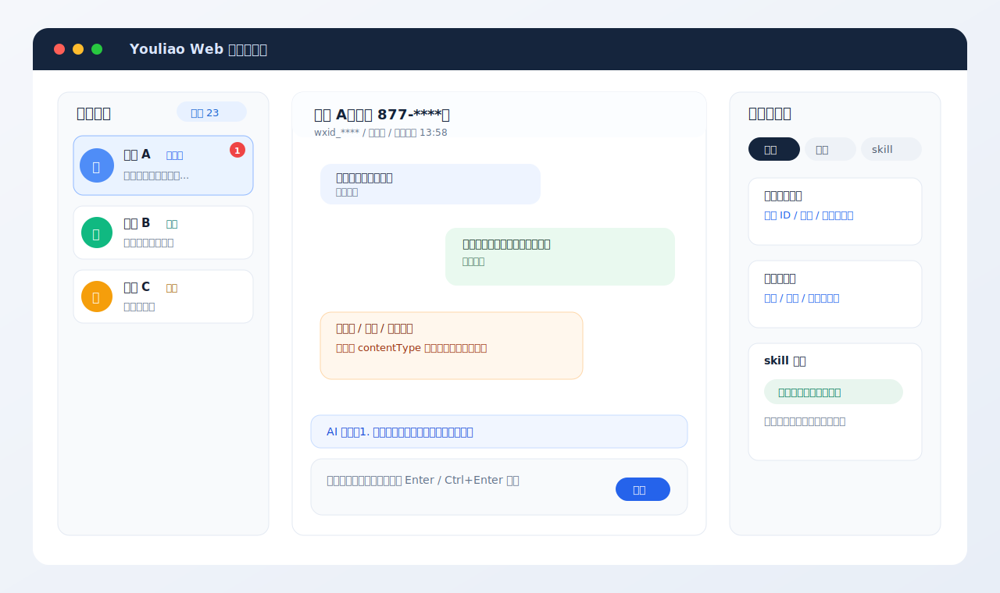
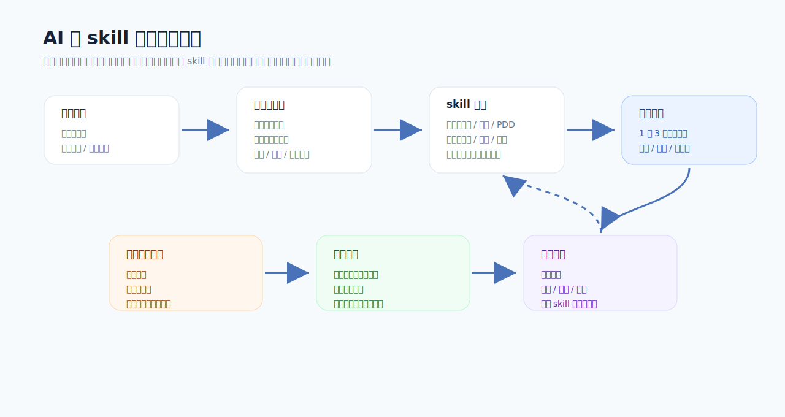
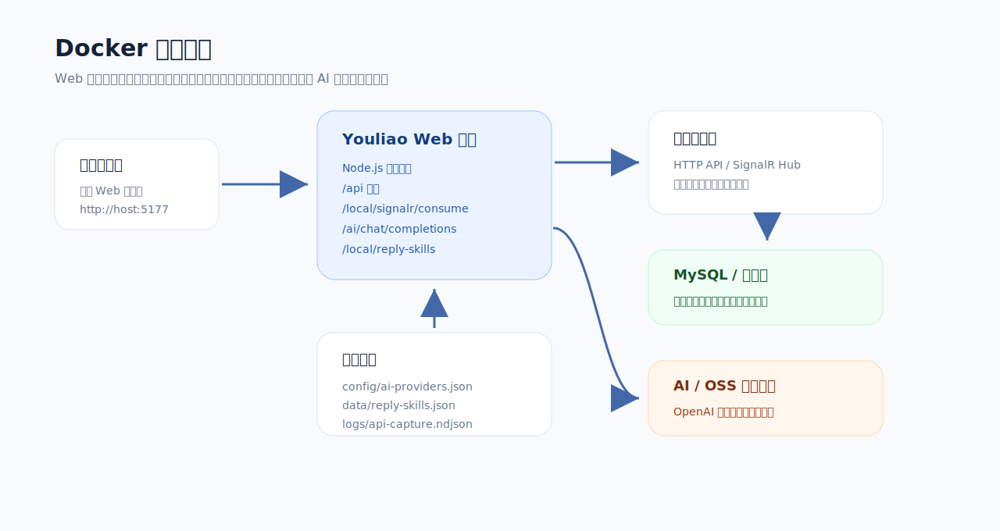

# Youliao Web

Youliao Web 是一个基于真实悠聊服务端接口的 Web 客服工作台二开项目。它不修改 Windows Electron 客户端安装包，而是通过悠聊 API、SignalR、OSS 上传和本地持久化文件，把原本偏桌面端的客服能力迁移到浏览器里，并预留 AI 辅助客服、skill 回复库和 Docker 部署能力。

> 文档图片均为脱敏示意图，不包含真实客户、订单、聊天记录或密钥。



## 适合场景

- 原有悠聊服务端已经跑在 Windows 或 Docker 中，希望客服用浏览器远程办公。
- 想在客服聊天页面里直接查看用户资料、历史聊天、订单、流水、快捷回复。
- 想接入 OpenAI 兼容模型，为客服提供推荐回复、文字优化、skill 回复和自动学习。
- 想把 Web 客户端、悠聊服务端、数据库和 AI 配置拆开维护，方便 Docker 部署和迁移。
- 想做二次开发，但不希望改动原 Electron 客户端安装包。

## 核心能力

### 1. 真实接口工作台

- 登录：`/System/LogIn`
- 配置探测：`/System/GetOptions`
- 会话列表：`/Contact/GetContactList`
- 聊天记录：`/ChatContent/GetList`、`/ChatContent/GetChatContentList`
- 清除红点：`/local/signalr/consume` 调用官方同源 SignalR `ConsumeMessage(contactId, 0)`
- 发送消息：`/ChatContent/SendMsg`
- 图片上传：`/ChatContent/GetOssConfig` 加 `/local/oss-upload`
- 指令、红包、人工接入、关闭会话、转 AI 等原生接口

Web 不使用假用户、假订单或假聊天记录。接口失败时会显示真实失败信息，并记录到 `logs/api-capture.ndjson` 方便继续排查。

### 2. 会话列表

- 支持当前、留言、历史三个分类。
- 按服务端真实时间排序，并支持滚动到底自动加载更多。
- 会话红点、未读数量、待办、置顶样式和右键操作按客户端习惯实现。
- 点击未读会话时，不会只在 Web 本地隐藏红点，而是先调用 SignalR 消费，再回查服务端确认 `unRead=0` 后才清本地角标。
- 会话列表获得焦点时，可用键盘上下箭头切换会话。

### 3. 聊天窗口

- 普通文本、系统提示、图片、链接、小程序、文件等消息类型分开渲染。
- 图片可在网页内浮层预览，支持打开原图和复制地址。
- 长链接会渲染成类似微信卡片，支持网页或视频预览。
- 小程序消息按小程序卡片展示，有真实封面优先使用真实封面，无封面时使用类型占位。
- 聊天记录顶部支持加载更多历史消息，最新消息保持在底部。
- 输入框支持文字、粘贴图片、拖入图片，发送时按真实接口分开发送文字和图片。
- 支持 `Enter 发送` / `Ctrl+Enter 发送` 切换，选择会持久化到浏览器。
- 发送按钮有锁定机制，避免图片或文字发送中多次点击导致重复发送。

### 4. 右侧工具栏

右侧工具栏用于把客服常用后台能力集中到聊天旁边：

- 用户信息：展示昵称、备注、用户 ID、机器人、来源等真实字段，蓝色字段可点击复制。
- 聊天记录：可独立滚动和加载更多，左右消息方向区分展示。
- 订单：按淘宝、京东、拼多多等平台分类展示，订单号和关键字段可复制。
- 账户流水：展示用户账户流水明细。
- 快捷回复：读取悠聊数据库里的快捷回复分类和内容。
- skill 回复：读取本地 `data/reply-skills.json`，按当前命中、平台、意图和分类展示。

### 5. AI 与 skill 回复



AI 功能通过 OpenAI 兼容接口代理 `/ai/chat/completions` 实现，支持不同渠道分别存储配置：

- Sub2API
- DeepSeek
- CodeBuddy
- 其他 OpenAI 兼容端点

能力包括：

- 根据客户上下文、快捷回复、skill 回复和右侧订单信息生成 1 到 3 条推荐回复。
- 客服输入文字后自动给出“可优化为”的候选文案。
- skill 命中后可直接发送，也可优化后更新 skill。
- 支持敏感词替换和话术变体，减少高度重复。
- 开启自动学习后，会记录客服未采用 AI/skill 推荐时的真实人工回复，用于后续训练。
- 提供独立 skill 训练页面，可按聚类后的相似问题逐条审核、优化、保存或删除。

AI 密钥不写死在公开仓库中。请在右上角 AI 设置或 `config/ai-providers.json` 中填入自己的 Key。

### 6. 客户端设置和数据库守护

- 右上角原生客户端设置与 Web AI 设置分离，避免混淆。
- 原生设置读取 `/System/GetOptions`，保存时调用真实服务端接口。
- 数据库管理支持按日期范围删除聊天记录，必须输入确认文案。
- 数据库守护可定时检查服务端是否异常切回 SQLite，如果配置了 MySQL 连接串，可以自动修复回 MySQL。

## 部署架构



推荐把 Web 客户端、悠聊服务端、数据库和 AI 渠道分开维护：

- Web 客户端：本项目，Node.js 静态服务和接口代理。
- 悠聊服务端：已有 Windows 服务或 Docker 服务。
- 数据库：MySQL 或服务端当前支持的数据库。
- AI 渠道：Sub2API、DeepSeek、CodeBuddy 或其他 OpenAI 兼容端点。

Docker 容器中访问宿主机服务端时，推荐使用：

```env
YOUCHAT_API_BASE=http://host.docker.internal:18080/api
```

Linux Docker 已在 compose 中配置：

```yaml
extra_hosts:
  - "host.docker.internal:host-gateway"
```

## 快速开始

### 本地运行

```powershell
npm install
$env:PORT = "5177"
$env:YOUCHAT_API_BASE = "http://你的悠聊服务端:18080/api"
npm run dev
```

打开：

```text
http://localhost:5177
```

首次使用 AI 和 skill 前，复制示例配置：

```powershell
Copy-Item config\ai-providers.example.json config\ai-providers.json
Copy-Item data\reply-skills.example.json data\reply-skills.json
```

### Docker 本地构建

```bash
docker compose -p youliaoweb -f compose.yaml up -d --build
```

访问：

```text
http://localhost:5177
```

### 使用 GHCR 镜像

GitHub Actions 会自动发布镜像：

```text
ghcr.io/525815266/youliaoweb:latest
```

准备目录：

```bash
mkdir -p ./config ./data ./logs
cp config/ai-providers.example.json ./config/ai-providers.json
cp data/reply-skills.example.json ./data/reply-skills.json
```

`.env` 示例：

```env
WEB_PORT=5177
YOUCHAT_WEB_IMAGE=ghcr.io/525815266/youliaoweb:latest
YOUCHAT_API_BASE=http://host.docker.internal:18080/api
YOUCHAT_DATABASE_GUARD_ENABLED=1
YOUCHAT_DATABASE_GUARD_INTERVAL_MS=300000
YOUCHAT_DATABASE_GUARD_MIN_HISTORY_COUNT=1000
```

启动：

```bash
docker compose -p youliaoweb -f compose.registry.yaml pull
docker compose -p youliaoweb -f compose.registry.yaml up -d
```

## 环境变量

| 变量 | 默认值 | 说明 |
| --- | --- | --- |
| `PORT` | `5177` | Web 服务端口 |
| `YOUCHAT_API_BASE` | `http://host.docker.internal:18080/api` | 悠聊服务端 API 地址 |
| `YOUCHAT_CONTAINER_API_BASE` | 空 | 容器内访问服务端的显式覆盖地址 |
| `YOUCHAT_CONTAINER_HOST_GATEWAY` | `host.docker.internal` | 容器访问宿主机时使用的网关域名 |
| `YOUCHAT_AI_BASE` | 空 | AI 默认端点覆盖 |
| `YOUCHAT_AI_MODEL` | 空 | AI 默认模型覆盖 |
| `YOUCHAT_MYSQL_CONNECTION_STRING` | 空 | 数据库修复用 MySQL 连接串 |
| `YOUCHAT_DATABASE_GUARD_ENABLED` | `1` | 是否启用数据库守护 |
| `YOUCHAT_DATABASE_GUARD_INTERVAL_MS` | `300000` | 数据库守护检查间隔 |
| `YOUCHAT_DATABASE_GUARD_MIN_HISTORY_COUNT` | `1000` | 判断历史数据异常的最低数量 |

## 本地文件

| 路径 | 是否提交真实文件 | 说明 |
| --- | --- | --- |
| `config/ai-providers.example.json` | 是 | AI 渠道示例配置 |
| `config/ai-providers.json` | 否 | 运行时 AI Key 和模型配置 |
| `data/reply-skills.example.json` | 是 | skill 回复库示例 |
| `data/reply-skills.json` | 否 | 运行时 skill 回复库和训练结果 |
| `logs/api-capture.ndjson` | 否 | Web 代理抓包日志 |

## 安全说明

公开仓库和镜像不内置任何 API Key、数据库密码、skill 私有库或抓包日志。请不要提交：

- `.env`
- `config/ai-providers.json`
- `data/reply-skills.json`
- `logs/`
- 真实客户截图、订单截图、聊天记录截图

## 开发检查

```bash
npm run check
```

该命令会检查：

- `server.js`
- `public/app.js`
- `public/skill-training.js`

## 目录结构

```text
server.js                         Node 服务、API 代理、SignalR 桥、AI 代理
public/                           Web 工作台前端代码和静态资源
public/assets/                    README 和界面使用的静态图片
config/ai-providers.example.json  AI 渠道示例配置
data/reply-skills.example.json    skill 回复库示例
compose.yaml                      源码构建部署
compose.registry.yaml             GHCR 镜像部署
.github/workflows/docker-publish.yml
                                  自动构建并发布 Docker 镜像
```

## 当前边界

- Web 端依赖悠聊服务端真实接口，服务端接口字段变化时需要继续适配。
- 快捷回复、订单、流水等功能以真实接口返回为准，不造假数据。
- AI 自动回复建议先在小范围场景验证，再打开自动发送开关。
- 数据库修复功能需要明确配置 MySQL 连接串，否则只做健康检查和提示。
